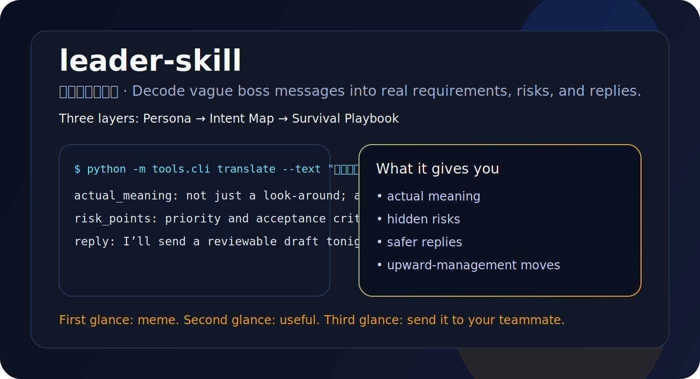
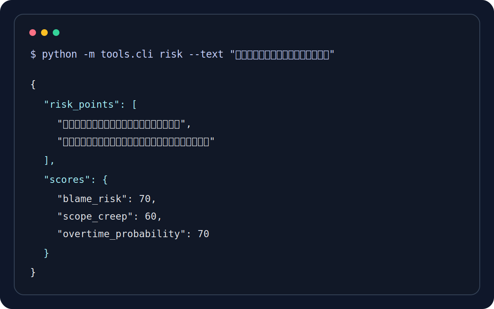

# 领导.skill


> 领导说“这个你先看一下”，到底是“先看看”，还是“今天先给初稿，明天同步背锅范围”？

`leader-skill` 是一个 local-first 的领导圣意解析器。  
它把模糊任务、黑话、催进度和“我们再对齐一下”，翻译成更可执行的东西：

- 实际意思
- 优先级判断
- 风险点
- 建议回复
- 向上管理打法

<p align="center">
  
</p>

## 30 秒看懂

它不是一个只会抖机灵的梗仓库，而是一个真的能跑、真的能演示、也真的容易传播的 skill 项目：

- 输入一句领导原话，直接输出结构化判断
- 输入多条材料，沉淀成一个本地领导画像 bundle
- 默认本地导入、本地分析，避免把职场素材随手外传
- 生成 `leaders/<slug>/` 目录并自动做版本快照

最常见的一句，直接试：

```bash
python -m tools.cli translate --text "这个你先看一下，晚点我们再对齐。"
```

你会得到类似这样的结果：

```md
# 领导黑话翻译

## 实际意思
这不是简单看看，而是希望你尽快形成反馈、判断或可评审产出。

## 画像摘要
推进节奏偏快，默认你会先垫出一版；习惯先推进再补边界；同步时会在意口径是否一致。

## 风险点
- 优先级没有被明确写出来，容易打乱你当前排期。
- 优先级和验收标准可能还没有真正定清。

## 建议回复
我先整理一版可评审内容，今晚给你初稿，明天同步时一起确认范围、优先级和验收标准。
```

## 为什么它比“纯梗项目”更像产品

`leader-skill` 的包装方式参考了 [colleague-skill](https://github.com/titanwings/colleague-skill) 和 [ex-skill](https://github.com/therealXiaomanChu/ex-skill) 这类高传播 skill 仓库，但分析对象换成了最常见也最有职场共鸣的一类人：领导。

| 项目 | 主要对象 | 传播点 | 真实使用价值 |
|---|---|---|---|
| colleague-skill | 同事 / 协作关系 | 性格梗、关系梗 | 快速理解协作风格 |
| ex-skill | 前任 / 情绪关系 | 记忆梗、话题性 | 做人物化还原 |
| leader-skill | 领导 / 汇报场景 | 黑话翻译、职场共鸣 | 把任务安排翻译成行动策略 |

`leader-skill` 多做的一步，是把“有梗”往“有用”再推进半步：

- 命令真的能跑
- 输出结构真的可读
- 示例目录真的能打开
- 版本回滚真的可用

## 安装

### 作为 Claude Code Skill

Claude Code 从当前仓库根目录的 `.claude/skills/` 查找 skill。你可以这样安装：

```bash
# 当前项目安装
mkdir -p .claude/skills
git clone https://github.com/Dewensong/leader-skill .claude/skills/create-leader

# 或安装到全局
git clone https://github.com/Dewensong/leader-skill ~/.claude/skills/create-leader
```

### 作为本地 CLI 试玩

```bash
git clone https://github.com/Dewensong/leader-skill.git
cd leader-skill
python -m pip install -r requirements.txt
python -m unittest discover -s tests -p "test_*.py"
```

## 先看成品，再决定要不要用

如果你想先看“生成后的领导画像 bundle”长什么样，直接打开这些文件：

- [examples/demo-leader/README.md](./examples/demo-leader/README.md)
- [examples/demo-leader/persona.md](./examples/demo-leader/persona.md)
- [examples/demo-leader/intent-map.md](./examples/demo-leader/intent-map.md)
- [examples/demo-leader/playbook.md](./examples/demo-leader/playbook.md)

这个示例是脱敏的、通用化的，用来证明输出结构和呈现方式，而不是影射某个真实人物。

## 支持来源

首发版本坚持 local-first，优先兼容你已经能拿到的材料：

| 来源 | 是否支持 | 当前方式 | 备注 |
|---|---|---|---|
| 粘贴文本 | Yes | 直接分析 | 最适合试用和演示 |
| 截图 | Yes | OCR sidecar / 预留真实 OCR | 建议先打码 |
| Markdown / TXT | Yes | 本地解析 | 适合会议纪要、群消息导出 |
| PDF | Yes | 本地解析 | 适合通知、方案、附件 |
| `.eml` / `.mbox` | Yes | 本地解析 | 适合邮件往来归档 |
| 聊天导出 JSON | Yes | 路由到 chat parser | 适合协作平台导出 |

<p align="center">
  
</p>

## 最容易出圈的 3 组场景

### 1. “这个你先看一下”

| 项目 | 内容 |
|---|---|
| 实际意思 | 不是随便看看，而是希望你尽快形成反馈或可评审产出 |
| 风险点 | 优先级没写死，容易打乱现有排期 |
| 建议回复 | 我先整理一版可评审内容，今晚给你初稿，明天同步时一起确认范围 |

### 2. “这个不复杂吧”

| 项目 | 内容 |
|---|---|
| 实际意思 | 需求还没完全定义，但默认你会先垫第一版 |
| 风险点 | 验收标准模糊，范围膨胀概率高 |
| 建议回复 | 我先按当前理解出一版方案，同时把目标、范围和验收标准列清楚 |

### 3. “我们再对齐一下”

| 项目 | 内容 |
|---|---|
| 实际意思 | 方向、责任或口径还没完全锁定 |
| 风险点 | 同步时如果没有可讨论版本，会被动挨改 |
| 建议回复 | 我先把方案、风险和待确认项整理好，明天同步时一起收口 |

## 命令接口

默认输出是更适合人读的 Markdown；如果你想接脚本，也可以显式加 `--format json`。

| 命令 | 作用 |
|---|---|
| `python -m tools.cli create-leader` | 创建一个新领导画像 |
| `python -m tools.cli list-leaders` | 查看已有实例 |
| `python -m tools.cli show-leader` | 打开完整领导画像 bundle |
| `python -m tools.cli translate` | 做黑话翻译 |
| `python -m tools.cli priority` | 看优先级信号 |
| `python -m tools.cli persona` | 看领导画像摘要 |
| `python -m tools.cli reply` | 生成更稳的回复和追问 |
| `python -m tools.cli risk` | 识别风险点和指数分 |
| `python -m tools.cli promotion` | 给出向上管理建议 |
| `python -m tools.cli leader-rollback` | 回滚到旧版本 |
| `python -m tools.cli delete-leader` | 删除实例 |

对应的 slash command 设计如下：

```text
/create-leader
/list-leaders
/{slug}
/{slug}-translate
/{slug}-priority
/{slug}-reply
/{slug}-risk
/{slug}-promotion
/leader-rollback {slug} {version}
/delete-leader {slug}
```

## 呈现方式

这套项目的重点不是“代码写很多”，而是“看上去像个真的可用产品”。

<p align="center">
  
</p>

## 项目结构

```text
leader-skill/
├── SKILL.md
├── README.md
├── README_EN.md
├── INSTALL.md
├── assets/
├── docs/
├── examples/
├── prompts/
├── tests/
└── tools/
```

推荐继续看：

- [INSTALL.md](./INSTALL.md)
- [docs/architecture.md](./docs/architecture.md)
- [docs/release-checklist.md](./docs/release-checklist.md)
- [examples/demo-leader/README.md](./examples/demo-leader/README.md)

## 安全说明

- 默认本地导入、本地分析
- 截图请先做脱敏
- 不要把它用于骚扰、伪造、监控或针对真实个人
- 它的目标是让沟通更清楚，不是让关系更糟

## 参考项目

- [titanwings/colleague-skill](https://github.com/titanwings/colleague-skill)
- [therealXiaomanChu/ex-skill](https://github.com/therealXiaomanChu/ex-skill)
