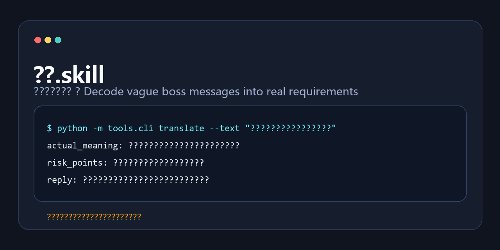

# 领导.skill

> 领导说“这个你先看一下”时，他到底是让你今天做、这周做，还是先热身准备背锅？

**`leader-skill`** 是一个本地优先的“领导圣意解析器”。
它会把模糊任务、黑话、套话和“先对齐一下”的空气，翻译成更可执行的人话，再顺手给你一版更稳的回复和向上管理建议。

<p>
  
</p>

## 为什么它容易让人秒懂

- 一眼能看懂：领导黑话翻译器
- 第二眼发现：不只是段子，真的能用
- 第三眼会想：发给同事一起看看

## 一句话价值

Decode vague boss messages into real requirements, risks, and upward-management replies.

## 最炸 Demo

输入：

```text
这个不复杂吧，你今天先出个方案，明天我们同步一下。
```

输出：

```json
{
  "actual_meaning": "需求还没完全定义，但对方默认你会快速交出第一版。",
  "priority_signal": "高优先级，建议当天给到初版或明确阻塞。",
  "risk_points": [
    "验收标准仍然模糊，后续容易出现范围膨胀。",
    "同步节点很近，说明至少需要一版能拿出来讨论的内容。"
  ],
  "reply_suggestion": "我先按当前理解出一版方案，同时把目标、范围和验收标准列清楚，避免明天同步时信息缺口。"
}
```

## 这不是换皮项目

这个项目参考了以下两个项目的设计思路和技能骨架：

- [titanwings/colleague-skill](https://github.com/titanwings/colleague-skill)
- [therealXiaomanChu/ex-skill](https://github.com/therealXiaomanChu/ex-skill)

但 `leader-skill` 的目标不是“复刻一个人”，而是把场景切到更真实的职场权力语言：

- `Leader Persona`：领导画像、风格、偏好、忌讳
- `Intent Map`：一句黑话背后的真实意思、优先级和风险
- `Survival Playbook`：怎么回、怎么追问、怎么汇报、怎么少背锅多拿 credit

## 功能结构

### 1. 真实意图识别

把这些话翻译成人话：

- “这个你先看一下”
- “这个不复杂吧”
- “我们再对齐一下”
- “你灵活处理一下”
- “你有空顺手看下”

### 2. 领导画像生成

从多次对话和材料里抽出领导类型：

- 愿景管理型
- 默认先给初稿型
- 会前补需求型
- 放权但保留追责权型
- 时间预期偏紧型

### 3. 生存手册输出

每次分析默认给你：

- 实际意思
- 优先级判断
- 风险点
- 建议回复
- 晋升打法

### 4. 本地导入优先

首发支持这些输入：

- 粘贴文本
- 截图图片
- Markdown / TXT
- PDF
- 邮件导出 `.eml` / `.mbox`
- 聊天导出 `.json` / `.txt`

## 命令接口

仓库里已经实现了对应 CLI，便于你本地先跑通。概念上的技能接口如下：

- `/create-leader`
- `/list-leaders`
- `/{slug}`
- `/{slug}-translate`
- `/{slug}-priority`
- `/{slug}-reply`
- `/{slug}-risk`
- `/{slug}-promotion`
- `/leader-rollback {slug} {version}`
- `/delete-leader {slug}`

本地 CLI 对应为：

```bash
python -m tools.cli create-leader --slug visionary-director --name "愿景型总监" --text "这个你先看一下"
python -m tools.cli list-leaders
python -m tools.cli translate --text "这个你先看一下，晚点我们再对齐。"
python -m tools.cli risk --text "这个不复杂吧，你今天先出个方案。"
python -m tools.cli reply --text "这个你灵活处理一下。"
```

## 安装

```bash
git clone https://github.com/Dewensong/leader-skill.git
cd leader-skill
python -m pip install -r requirements.txt
```

如果你只想体验核心功能，不安装依赖也能跑文本分析：

```bash
python -m tools.cli translate --text "这个你先看一下"
```

## 三组最适合传播的示例

### 示例 1：这个你先看一下

输入：

```text
这个你先看一下，晚点我们再对齐。
```

输出重点：

- 实际意思：不是简单看看，而是希望你尽快形成反馈或产出
- 风险点：优先级没写死，容易挤占你现在的排期
- 建议回复：今晚先给一版可评审内容，明天同步时顺手把范围和验收标准锁住

### 示例 2：这个不复杂吧

输入：

```text
这个不复杂吧，你今天先出个方案，明天我们同步一下。
```

输出重点：

- 实际意思：需求还没完全定义，但默认你会快速垫一版
- 风险点：验收标准模糊、同步节点过近、返工概率高
- 指数分：甩锅风险高、今晚加班概率高

### 示例 3：我们再对齐一下

输入：

```text
我们再对齐一下，我感觉方向上还可以更高级一点。
```

输出重点：

- 实际意思：方向还没拍稳，但你需要带着更完整的方案回来
- 风险点：评价标准抽象，很容易继续迭代
- 建议动作：要对方给参考案例，或者明确“不想要什么”

## 目录结构

```text
leader-skill/
├─ SKILL.md
├─ prompts/
├─ tools/
├─ leaders/
├─ docs/
├─ assets/
├─ tests/
├─ README.md
├─ README_EN.md
├─ INSTALL.md
└─ requirements.txt
```

## 核心实现

- `tools/analysis_engine.py`
  - 黑话识别、风险打分、回复建议、晋升建议
- `tools/source_router.py`
  - 根据输入文件类型路由到不同解析器
- `tools/skill_writer.py`
  - 生成 `persona.md`、`intent-map.md`、`playbook.md`
- `tools/version_manager.py`
  - 快照与回滚

## 快速开始

### 1. 用一句话创建一个领导画像

```bash
python -m tools.cli create-leader \
  --slug visionary-director \
  --name "愿景型总监" \
  --text "这个你先看一下，晚点我们再对齐。"
```

### 2. 看看本地已经生成了哪些领导实例

```bash
python -m tools.cli list-leaders
```

### 3. 单独做黑话翻译

```bash
python -m tools.cli translate --text "这个你灵活处理一下。"
```

### 4. 做风险分析

```bash
python -m tools.cli risk --text "这个不复杂吧，你今天先出个方案。"
```

## 测试

```bash
python -m unittest discover -s tests -p "test_*.py"
```

## 发布建议

这个项目最适合的发布姿势不是“求 star”，而是直接发一张 demo 图：

- “领导说‘这个你先看一下’时，他到底在想什么？”
- “把领导一句‘简单做个方案’翻译成人话”
- “这个 skill 会自动识别画饼、甩锅、模糊优先级和返工风险”

更多首发动作可以看：

- [docs/release-checklist.md](./docs/release-checklist.md)

## 免责声明

- 这个项目用于职场沟通理解与表达辅助，不用于攻击、骚扰、伪造指令或监控真实个人。
- 默认推荐本地导入、本地分析；如果你要分享截图，请先打码。
- 它不能替代真实沟通，只能帮你少做一点“工伤式理解”。
